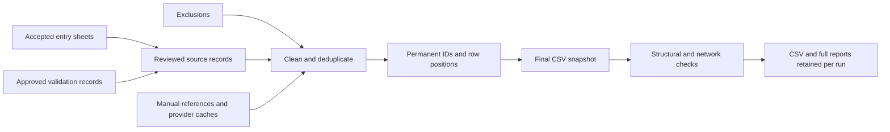

# FLoRA pipeline integration report

Updated: 16 September 2026

## Result

The existing website now has a complete preparation action, final CSV downloads,
and per-run Markdown/JSON reports. The supplied R workflow has been mapped into
the Python application, including its reference caches and manual citations.

The delivered [`output/flora.csv`](../output/flora.csv) contains **2,914 rows and
37 columns**: `id`, `id_md5`, followed by all 35 original columns. Automated
comparison verified **all 101,990 original cells**, column order, and row order
against `flora (18).csv`. No original data value was changed in this snapshot.

This file reproduces the supplied snapshot with the requested IDs. Future website
runs build from the current reviewed database and refreshed sources, so corrections,
new records, exclusions, and deduplication decisions can change its contents.
The baseline fixes order and initial identities; it does not reinsert excluded or
absent records into the current database.

### Prepared database table follow-up

The complete preparation output now has a separate `flora_data` table. Normal
database preparation stores the candidate with permanent `id` and generated
`id_md5`, preserves publication positions, and retires missing records without
deleting their identities. Python helpers support title/DOI search and full
ID-hash lookup. See [Prepared FLoRA database table](FLORA_DATA_TABLE.md)
for the schema, complete-snapshot import commands, and backup requirements.
Production migration/import remain pending.
The full 2,914-row import/export matched the delivered CSV byte for byte in a
disposable local PostgreSQL database; repeating the import left records unchanged.
The table guide also documents recovery when database commit succeeds but final
CSV publication fails, including the retained committed CSV and report status.

### Public API follow-up

The existing website now implements `/v1/prefix-lookup`, `/v1/original-lookup`,
`/v1/dois`, and `/v1/search` with the supplied backend's DOI response structure,
plus `/v1/id-lookup` for complete MD5 hashes of permanent row IDs. The supplied
snapshot yields 4,817 DOI aggregates; all 2,914 rows remain available by ID hash,
including the two rows with neither DOI. Distinct rows sharing a DOI pair retain
their separate permanent IDs in the relationship arrays.

The API reads the committed PostgreSQL snapshot and checks its shared revision
when using cached aggregates. It does not alter the supplied CSV. Search filters
before pagination; its Python similarity scores are not exact Fuse.js scores.
See the [public API guide](FLORA_API.md) for endpoints, public field selection,
`apiEmail` payload suppression, CORS, errors, and request examples. No AWS changes
or production API deployment were performed.

### Delivered files

| File | Purpose |
| --- | --- |
| [`output/flora.csv`](../output/flora.csv) | Final supplied snapshot, with IDs first |
| [`output/flora_preparation_report.md`](../output/flora_preparation_report.md) | Complete validation findings for this file |
| [`output/flora_preparation_report.json`](../output/flora_preparation_report.json) | Machine-readable run details |
| [`output/flora_release_manifest.json`](../output/flora_release_manifest.json) | Exact file SHA-256, MD5, size, row/column counts |
| [`output/flora_reference_with_ids.report.json`](../output/flora_reference_with_ids.report.json) | Reference comparison metadata |
| [`reference_pipeline/manifest.json`](../reference_pipeline/manifest.json) | Inventory and fingerprints of all supplied files |

The reference dataset contains 2,557 replication rows and 357 reproduction rows.
The file uses UTF-8 with an Excel-compatible BOM, quoted CSV fields, `NA` for
missing values, and preserved embedded newlines. CSV quoting differs from the
input's serialization; the original parsed cells are identical.

## Identity and ordering

1. `id` is the permanent exported record ID. Initial reference records use
   `FLORA-000001` through `FLORA-002914`, assigned in the supplied order.
2. `id_md5` is the complete 32-character lowercase MD5 of the UTF-8 `id` string.
   It is a reproducibility checksum, not an authentication mechanism.
3. The next 35 columns have exactly the supplied names and order. The existing
   three-character `doi_o_hash` and `doi_r_hash` fields remain separate.
4. The normal website export retains its extra OpenAlex IDs, author overlap,
   abstract, reproduction evidence, and provenance columns after those 35.
5. Database fields `flora_records.export_id` and `export_position` pin identities
   and positions. New records receive positions after the reference and every
   previously allocated position. Retired positions are never reused.
6. Matching uses the original paper, replication paper, report URL, and type;
   distinct individual report URLs remain distinct. Ambiguous DOI-pair matches
   do not acquire a reference identity by guesswork.
7. A DOI correction or a change in the surviving source record preserves an
   already-pinned identity. When a merged group splits, its former primary keeps
   its identity and the newly distinct record gets a separate ID. The entire
   reference ID namespace is reserved against legacy/new-record collisions.

The grid retains its source-facing ID and shows a separate CSV ID when different.
Exported IDs are searchable and accepted by the record-detail lookup.

## Website and execution flow

In **Admin → Source Records**, select **Run pipeline + report**. The existing
background queue performs these stages:



The metadata stage supplies Crossref/DataCite citations, OpenAlex metadata,
OSF references, and Unpaywall links. The final stage validates the actual CSV
candidate, checks IDs/hashes, writes a release manifest and history, and publishes
the completed candidate to the run's download storage.

Completed runs retain their exact CSV and reports in `source_sync_jobs`, shared
across web pods. Downloads require the existing admin session and accept only
known artifact names. A failed upstream stage produces a failure report with no
CSV download for that run. Data findings produce a **Needs review** state with
the CSV and detailed findings available. Network outages, skipped checks, and
limited coverage remain explicit in reports.

The FLoRA tab also provides independent **full** and **filtered** current CSV
downloads. Both share the pipeline serializer and missing-title rule. Metadata,
registry, vocabulary, and exclusion changes invalidate the derived dataset cache.

The scheduled GitHub workflow uses the same `prepare_flora.py` command and uploads
current artifacts only after successful preparation. It no longer opens external
review issues during the build.

## Supplied helper coverage

All 20 supplied files are inventoried. Numbered duplicate filenames are retained
in the manifest; byte-identical duplicate helpers have one canonical copy.

| Supplied helper/workflow | Website implementation and scope |
| --- | --- |
| `prepare_flora.qmd` | Existing source sync and transform stages plus `prepare_flora.py`; one final candidate, validation, summaries, and downloads |
| `cache_config.R` | Shared PostgreSQL metadata/network caches, configured workbook and frozen seed |
| `crossref_cache.R` | `bibliographic_helpers.py`, `enrich_works.py`: manual precedence, Crossref → DataCite → DOI content negotiation, APA/BibTeX, structured author fields, BibTeX recovery, URL/DUMMY keys |
| `openalex_cache.R` | Existing DOI/work-ID enrichment plus language, abstract reconstruction, and imported cached fields |
| `unpaywall_cache.R` | Direct Unpaywall lookup and supplied OA cache; closed-access responses can clear stale OA URLs |
| `osf_citation.R` | OSF node/file citation lookup and bibliographic-field recovery |
| `augmentation.R` | HTML/entity/line-break cleaning, author overlap, structured JSON author support and full-team percentages |
| `preprint_dedup (1).R` | Existing confirmed replacement, candidate detection and merging; structured first-author support and stable publication identity handling |
| `cos_quote_rewrite.R` | Existing COS shorthand expansion before downstream merging |
| `outcome_vocabulary.R` | Existing canonical vocabulary and aliases, reproduction axes, strict invalid-axis checks, export validation for both record types |
| `llm_classification.R` | The supplied notebook disables repeated classification and uses 16 frozen COS exclusions; this behavior is preserved. The R classifier is archived for an intentional future refresh |
| `validate_flora (1).R` | Structural CSV checks, suppression support, readable and machine-readable findings; both current website and supplied source labels accepted |
| `validate_flora_network (1).R` | DOI/URL resolution, Retraction Watch, shared success cache, explicit unavailable/skipped/deferred coverage |
| Both `filter_flora.R` copies | Optional `filter_flora.py`: separate API derivative, identifier validation, Boyce exclusion, retractions, OSF registrations, removal log; does not alter main `flora.csv` |
| `release_helpers.R` | Local release manifest, full file hashes, version helpers and release notes. OSF upload remains a separate publication operation |
| `update_readme_log.R` | Shared daily dataset history, per-run CSV history and Markdown summary; the website retains its existing history display rather than the R script's static PNG |
| Both `data_cleaning.R` copies | Archived intact. These clean the FReD effect/statistic dataset and are not sourced by `prepare_flora.qmd`; their FLoRA-relevant text/DOI cleanup already runs in the transform |

The existing source registry remains the source of URLs and accepted statuses.
Approved extractor records enter through the application's own `validated` table
and `sync_validated.py`, replacing the notebook's remote validated-export download.
The current reproduction codebook remains authoritative; archived axis aliases
are accepted without forcing the website back to older spellings.

## Imported cache and reference material

The user supplied `C:/Users/hamid/Documents/GitHub/FReD-data/cache` after the
initial audit. It was read without modifying the original folder.

- `data/manual_references.xlsx`: the supplied workbook contains 254 distinct nonblank keys; 263 lookup keys
  are available after adding its applicable cached DOI aliases.
- `data/reference_metadata_seed.json.gz`: 5,195 merged cached metadata records
  and 285 URL-to-DOI aliases. Source filenames, byte sizes, and SHA-256 hashes are
  embedded in the seed.
- Imported sources: Crossref fields/citations, URL-to-DOI mappings, OpenAlex
  language/abstract/work-ID files, and Unpaywall OA data.
- The existing and supplied preprint caches have the same 47 effective decisions;
  no decision replacement was needed.
- The website consumes the portable seed with Python. R and `jsonlite` are needed
  only for converting a future updated `.rds` cache through the supplied import script.

## Validation of the delivered snapshot

The identity check passed for all 2,914 rows. The structural checks produced
**557 review findings**, with **zero execution failures**:

| Check | Findings |
| --- | ---: |
| Blank/invalid outcomes | 354 |
| Values in URL columns without an HTTP prefix | 125 |
| Missing required identifiers/fields | 37 |
| Repeated original/replication DOI pairs | 28 |
| DOI-format findings | 9 |
| Replication year before original year | 2 |
| Year outside the check's range | 1 |
| DOI with substantially different reference text | 1 |

These are check findings, not 557 distinct erroneous records: a row may appear
under several checks. In particular, shared DOI pairs can represent distinct
individual reports, and meta-paper annotations can explain reference differences.
The 354 blank outcomes comprise 352 reproduction rows and two replication rows
already blank in the supplied file. The implementation does not invent values to
make the reference snapshot pass. See the full validation artifact for every item.

The delivered snapshot was checked offline. DOI resolution, retractions and OSF
network status were **not** claimed as verified. Normal full website runs request
these checks and clearly report failures or incomplete coverage.

## Verification performed

- **1,268 Python tests passed**, including the opt-in real PostgreSQL integration
  checks. The only warning was an existing Google SDK deprecation under Python 3.14.
- Applied the entire schema twice to isolated local PostgreSQL databases, checking
  both fresh installation and idempotent migration.
- Exercised real database source insertion, cached metadata joins, transformation,
  registry allocation, DOI correction, append order, final preparation, and shared
  per-run CSV/report storage.
- Verified website, pipeline, and prepared-table CSV bytes are identical for the same database fixture.
- Imported and re-exported all 2,914 reference rows through `flora_data` with exact
  byte equality, and verified that repeated imports do not change row versions.
- Tested permanent IDs and hashes through corrections, retirement, restoration,
  multiple deduplication survivor changes, and standalone preparation. Database
  guards reject ID changes, deletion, and truncation of identity tables.
- Tested indexed title/DOI lookup, hash lookup, registry position gaps, transaction
  rollback, malformed snapshots, and recovery after a committed import encounters
  a locked final CSV file.
- Exercised the public HTTP routes against the complete supplied snapshot:
  4,817 DOI aggregates and all 2,914 permanent ID hashes resolved. The original
  CSV bytes and stored record versions stayed unchanged. Five captured
  request/response examples are in
  [`output/flora_api_examples.json`](../output/flora_api_examples.json).
- Public API checks cover derived-field suppression, duplicate DOI-pair IDs,
  search filters/pagination, cache refresh after a committed snapshot, retired
  ID lookup, read-only database enforcement, field allowlists, malformed requests,
  CORS, and continued cross-site protection for administrator writes.
- Compared every original cell and row in the delivered full-size reference export;
  checked uniqueness and MD5 for every ID.
- Tested enrichment provider success/fallback/miss/outage behavior with mocked HTTP,
  including manual overrides, JSON authors and nested BibTeX.
- Tested failed-stage isolation, candidate replacement, report hashes, limited
  network coverage, optional filters and authenticated artifact routes.
- Chromium browser checks passed for run dispatch, active/failure/review states,
  CSV/report downloads, full-versus-filtered exports, escaping, and mobile controls.
- JavaScript syntax checks passed. Browser screenshots are available locally in
  `logs/pipeline-ui/`.

### Review fixes: 16 September 2026

All four findings from the uncommitted-change review have been addressed:

1. **Permanent browser-export IDs.** Browser exports reject records without a
   registered publication ID and position, returning HTTP 409 with instructions
   to run the pipeline. They no longer export a provisional UUID that later
   changes into a different ID and MD5.
2. **Overlapping preparations.** Preparation captures the stored dataset revision
   before building. Materialization compares that revision under its database
   write lock. If another run publishes meanwhile, the candidate is rejected and
   the report asks for a rerun. This covers website, scheduled, and CLI preparation
   without holding a transaction open during network validation. Explicit
   standalone imports remain deliberate complete-snapshot replacements.
3. **Consistent release files after failure.** The manifest, release notes, history,
   and summary are staged before storage. Publication backs up the existing
   release files and restores replaced files on an operating-system error. A
   failed database write leaves the previous release bundle untouched. If storage
   committed before publication failed, the committed candidate remains available
   as a recovery CSV.
4. **Durable website downloads.** The job's CSV and report are committed to the
   shared database before conventional local copies are attempted. A local-copy
   failure becomes a report warning; the successful job retains its downloads.

Seven new regression cases cover these paths, including overlapping runs against
both an empty and an initialized prepared table, real PostgreSQL identity checks,
storage failure, locked CSV/summary files, and a locked website-local copy.
The focused suite passed 72 checks; the full Python suite passed all 1,258 tests
in 37.39 seconds with one existing Google SDK deprecation warning. `git diff
--check` passed. The delivered `output/flora.csv` checksum remains unchanged.

### Second review fixes: 16 September 2026

The three additional review findings have also been addressed:

1. **Output folder ownership.** Preparations acquire an operating-system file
   lock before writing any candidate or report. Runs targeting the same folder
   wait for one another, including publication and cleanup; runs using separate
   folders retain the existing database revision check. The lock works across
   threads and processes on Windows and Unix and is released on process exit.
   Website copies into the conventional output folder use the same lock.
2. **Retained recovery downloads.** A website run that commits the database but
   fails CSV publication now stores the exact recovery bytes in the new
   `source_sync_jobs.recovery_csv` column before removing its temporary folder.
   The hash is checked against the candidate manifest. The job remains failed,
   with a separate authenticated **Download recovery CSV** button and explanatory
   report. This also handles the fallback `.flora.candidate.csv` file. If artifact
   persistence itself raises an error, the workspace is retained and its path is
   recorded in the runner error for local recovery. Normal startup applies the
   idempotent schema addition.
3. **No stale filtered output.** A filter attempt removes the previous derivative
   from `flora_filtered.csv` before running filters. A provider outage or invalid
   input therefore cannot leave an older CSV at the current output path. Reading
   the input first preserves intentional in-place re-filtering.

Ten additional Python cases cover these changes, including a real PostgreSQL
commit followed by publication failure, both recovery paths, authenticated
downloads, concurrent writers in threads and separate processes, and filter
failure cleanup. The focused suite passed 59 checks; the full suite passed
**1,268 tests in 42.63 seconds**, with the existing Google SDK deprecation warning.
Chromium verified the recovery download button and request alongside the existing
pipeline controls. JavaScript syntax and `git diff --check` passed. The delivered
CSV retains SHA-256
`d7a54f14acf016260199e3b5bcb0104e175cb0d0c5ee7e5e53b5477d84ebb6e4`.

## Configuration and commands

The ordinary application requirements remain `DATABASE_URL`, admin credentials
for first startup, and the existing Python dependencies. New optional settings
are documented in `.env.example`:

| Setting | Purpose |
| --- | --- |
| `FLORA_MANUAL_REFERENCES` | Override the bundled manual workbook with CSV/XLSX |
| `FLORA_REFERENCE_SEED` | Override the portable metadata seed |
| `OPENALEX_MAILTO` | Provider contact email |
| `UNPAYWALL_EMAIL` | Optional separate Unpaywall contact email |
| `FLORA_API_FILTER=1` | Produce the separate API derivative in a website run |

After the updated application is deployed/restarted, its existing startup schema
initialization adds the new columns. Then use **Run pipeline + report**. A normal
run allocates publication IDs before exporting; browser reads do not write IDs.

To reproduce the delivered reference snapshot locally:

```powershell
.\.venv\Scripts\python.exe final_export.py
.\.venv\Scripts\python.exe prepare_flora.py --input output/flora_reference_with_ids.csv --output-dir output --network-checks none
```

To prepare the current database after its sync/enrichment/registry stages:

```powershell
.\.venv\Scripts\python.exe prepare_flora.py --output-dir output
```

To produce the separate API derivative alongside a preparation run, add
`--api-filter`. For local inspection without network requests, combine it with
`--network-checks none`; its report will explicitly mark network filters skipped.

## Deployment status and limits

The repository implementation and local artifacts are complete and tested. This
session did not deploy the website, mutate the production database, run the entire
live source refresh, send messages, publish an OSF release, or push a Git commit.
Production source/API availability therefore remains to be checked by the first
full run in the deployed environment. All files needed from the supplied cache
are now bundled; no additional input file is currently required.

The optional API derivative is retained as local/workflow artifacts; the website
download buttons expose the main final CSV and full Markdown/JSON reports. External
OSF publishing and refreshing the frozen one-off LLM classification remain separate
operations from preparing the requested dataset.
